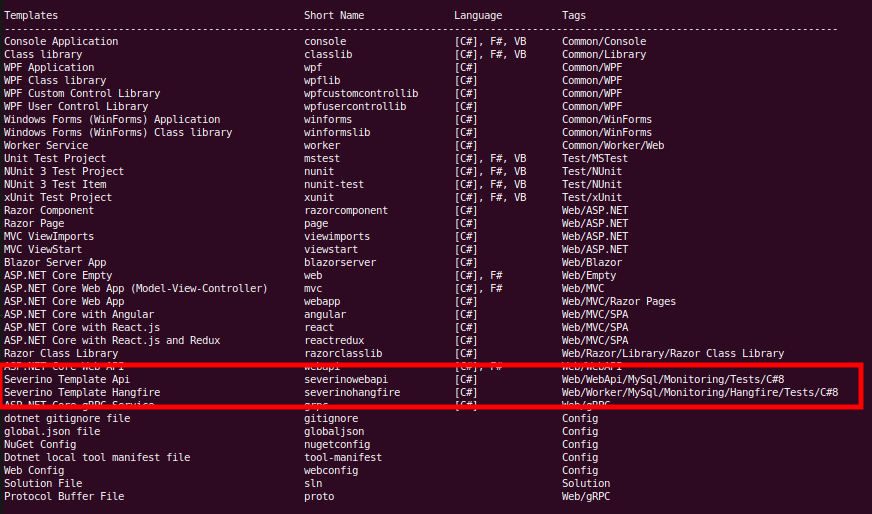

# Severino Templates

.Net Core Templates

* [Webapi](./working/templates/severino-template-api/README.md)
* [Worker Hangfire](./working/templates/severino-template-hangfire/README.md)

## Instalação

Clone o projeto e depois execute o comando abaixo na pasta `/working`.

``` bash
dotnet pack

cd bin/Debug

dotnet new -i ./bin/Debug/Severino.Templates.<version>.nupkg
```

> A palavra `<version>` deve ser substituída pela versão atual do projeto.

Após a instalação os novos templates estarão disponíveis

