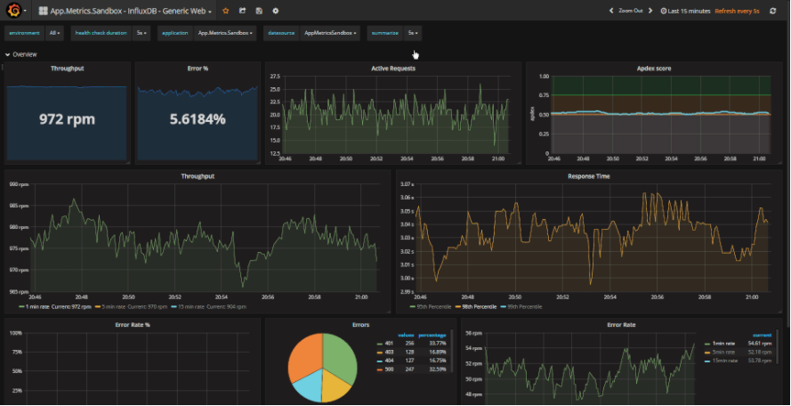
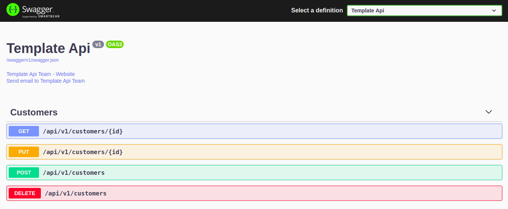

# Template Api

Template com recursos pré configurados para facilitar o inicio de novos desenvolvimentos

* [Recursos](#recursos)
    - [Monitoramento](#monitoramento)
    - [Health Checks](#health-checks)
    - [Documentação APIs](#documentação-apis)
    - [Migrations](#migrations)
* [Desenvolvimento](#desenvolvimento)
    - [Requisitos](#requisitos)
    - [Instalação](#instalação)
        - [Docker](#docker-compose)
        - [.Net Core 3.1](#net-core-3.1)
        - [VS Code](#visual-studio-code)
    - [Configuração](#configuração)
    - [Compilação e execução](#compilação-e-execução)

## Recursos

### Monitoramento

O aplicativo conta com monitoramento automático das APIs.É utilizado o `InfluxDB` como banco de dados das métricas e `Grafana` para visualização.

> Na pasta raiz do projeto existe o arquivo `docker-compose.yml` com as configurações para utilizar o InfluxDB e Grafana no ambiente de desenvlvimento.
>
> A visualização utilizada no Grafana está disponível no [GrafanaLabs](https://grafana.com/grafana/dashboards/2125).



Para a configuração do monitoramento é necessário informar as variáveis de ambiente para conexão com o banco de dados InfluxDB.

``` 
INFLUXDB_URL                => Url para conexão com banco Influx
INFLUXDB_DATABASE           => Nome do banco de dados influx
INFLUXDB_USERNAME           => Usuário de conexão com o banco influx
INFLUXDB_PASSWORD           => Senha de usuário do banco influx
INFLUXDB_FLUSH_INTERVAL     => Intervalo para envio das métricas
METRICS_CONTEXT             => Nome contexto das métricas
```

> Quando a váriavel `INFLUXDB_URL` não é definida a coleta e envio das métricas não é ativado.
>
> Saiba mais sobre as váriaveis de ambiente em [Configuração](#configuração).

### Health Checks

Endpoint `/healthchecks` para verificação de saúde da aplicação. Nesse endpoint é feita a validação se os recursos necessários para o bom funcionamento da aplicação estão disponíveis.

Quando sucesso, além do HTTP Status 200, o endpoint retorna uma lista com os recursos verificados, com seu status e o tempo gasto para cada verificação.

``` json
{
  "status": "Healthy",
  "totalDuration": "00:00:00.0956331",
  "entries": [
    {
      "name": "TemplateDb",
      "data": {
        
      },
      "status": "Healthy",
      "duration": "00:00:00.0785531"
    }
  ]
}
```

Para aterar os itens que são verificados no endpoint de health check basta alterar o método `AddAppHealthChecks` no arquivo `Extensions/HealthChecksExtensions` . Saiba mais sobre a configuração de [HealthChecks](https://docs.microsoft.com/pt-br/aspnet/core/host-and-deploy/health-checks?view=aspnetcore-3.1) e os [plugins](https://github.com/Xabaril/AspNetCore.Diagnostics.HealthChecks) disponíveis.

### Documentação APIs

Para a documentação é utilizado o [Swagger](https://swagger.io/). Ferramenta que provê interface para testes e também um arquivo .json com as configurações de todos os endpoints.



Por padrão a documentação está disponível no endpoint `/api/docs` . A documentação pode ser customizada a partir do arquivo `appsettings.json' alterando a seção exemplificada abaixo:

``` json
{
  "ApiDocumentation": {
    "AppName": "Template Api",
    "Description": "Template de API com conexão com banco de dados, monitoramento, health-checks e migrations",
    "Owner": "Template Api Team",
    "Email": "template.api@gmail.com",
    "Url": "http://google.com",
    "DocJson": "/swagger/v1/swagger.json",
    "DocRoute": "api/docs"
  }
}
```

### Migrations

São utilizadas as evoluções de banco automáticas do Entity Framework Core. Foi utilizado o modelo `Code First` e as configurações utilizando o [Fluent API](https://www.entityframeworktutorial.net/efcore/fluent-api-in-entity-framework-core.aspx) das entidades estão em `Repositories/Configurations/Models`.

Saiba mais sobre os [Migrations](https://docs.microsoft.com/pt-br/ef/core/managing-schemas/migrations/?tabs=dotnet-core-cli).

> As classes de configuração são inseridas automaticamente ao contexto do banco de dados

## Desenvolvimento

### Requisitos

``` 

* .Net Core 3.1
* Docker
* Docker Compose
* Mysql
* InfluxDb
* Grafana

``` 

### Instalação

#### Docker compose:
Acessar a pasta raiz do projeto e executar:
```

https://docs.docker.com/compose/install/
docker-compose up -d

``` 

#### .Net Core 3.1

```

wget -q https://packages.microsoft.com/config/ubuntu/19.04/packages-microsoft-prod.deb -O packages-microsoft-prod.deb

sudo dpkg -i packages-microsoft-prod.deb

sudo apt-get update

sudo apt-get install apt-transport-https

sudo apt-get install dotnet-sdk-3.1

``` 

#### Visual Studio Code

```

https://code.visualstudio.com/docs/?dv=linux64_deb

https://github.com/OmniSharp/omnisharp-vscode

``` 

### Configuração

Lista de variáveis de ambiente necessárias para a execução da aplicação

|         Variável        |                   Descrição                  |   Tipo   | Obrigatório | Valor Padrão |
| ----------------------- | -------------------------------------------- |:--------:|:-----------:|:------------:|
| DB_TEMPLATE_SERVER      | Ip ou endereço do servidor de banco de dados |   Texto  |     Sim     |              |
| DB_TEMPLATE_DATABASE    | Nome do banco de dados                       |   Texto  |     Sim     |              |
| DB_TEMPLATE_USER        | Usuário para conexão de dados                |   Texto  |     Sim     |              |
| DE_TEMPLATE_PASSWORD    | Senha do usuário para acesso ao banco        |   Texto  |     Sim     |              |
| DB_TEMPLATE_POOLING     | Indica se deve ser usado pooling de conexão  |  Boolean |     Não     |     false    |
| DB_TEMPLATE_POOLING_MIN | Quantidade mínima de conexões no pool        | Numérico |     Não     |       1      |
| DB_TEMPLATE_POOLING_MAX | Quantidade máxima de conexões no pool        | Numérico |     Não     |       3      |
| INFLUXDB_URL            | Url para conexão com banco Influx            |   Texto  |     Não     |              |
| INFLUXDB_DATABASE       | Nome do banco de dados influx                |   Texto  |     Não     |              |
| INFLUXDB_USERNAME       | Usuário de conexão com o banco influx        |   Texto  |     Não     |              |
| INFLUXDB_PASSWORD       | Senha de usuário do banco influx             |   Texto  |     Não     |              |
| INFLUXDB_FLUSH_INTERVAL | Intervalo para envio das métricas            |   Texto  |     Não     |              |
| METRICS_CONTEXT         | Nome contexto das métricas                   |   Texto  |     Não     |              |
| WORKER_QUEUES           | Filas que serão processadas pela instância   |   Texto  |     Não     |  "Default"   |
| WORKER_DASH_PATH        | Path para visualização do dashboard          |   Texto  |     Não     |     ""       |
| DASH_USER               | Usuário padrão para DashBoard                |   Texto  |     Sim     |              |
| DASH_PASSWORD           | Senha do Usuário padrão para DashBoard       |   Texto  |     Sim     |              |

### Compilação e execução

Após a [Configuração](#configuração) da aplicação executar os comandos abaixo na pasta raiz do projeto e executas os comandos abaixo.

```bash
# Restaura as bibliotecas do projeto
 dotnet run restore

# Compila a solução
 dotnet run build

# Executa o projeto
 dotnet run -p ./src/Severino.Template.Hangfire/Severino.Template.Hangfire.csproj 
```

